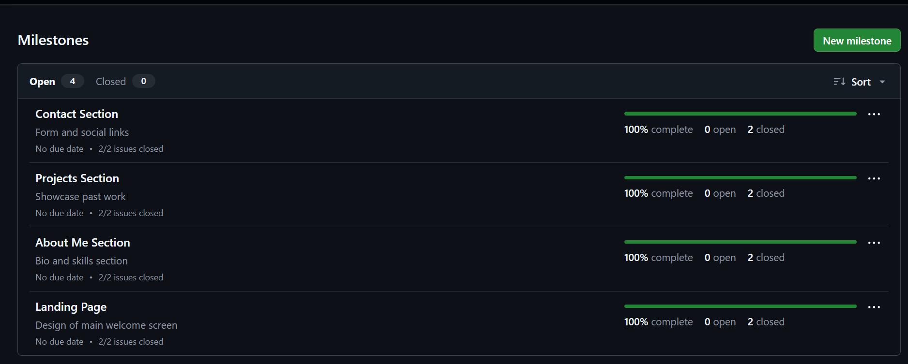
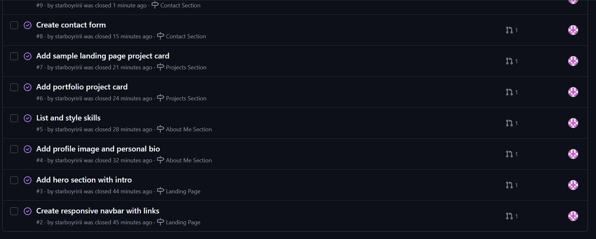
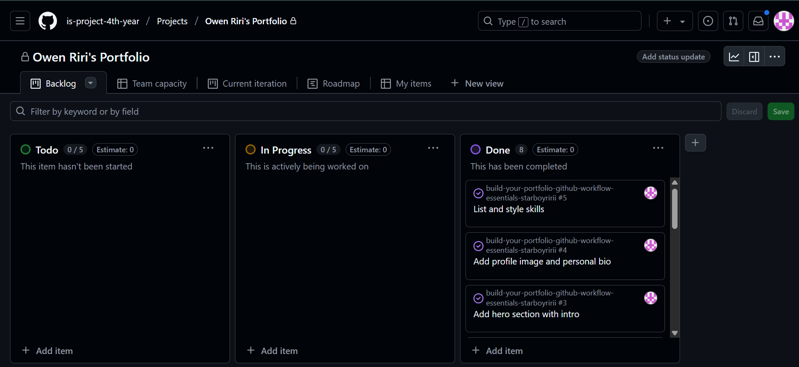
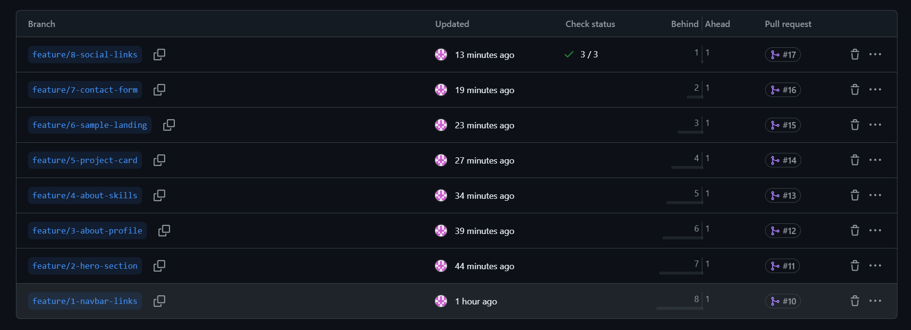
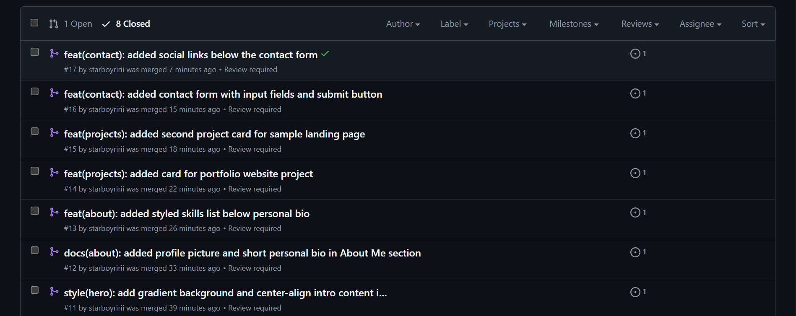

# Personal Portfolio Documentation

## 1. Student Details

- **Full Name**: Owen Riri
- **Admission Number**: 151778
- **GitHub Username**: starboyririi
- **Email**: owen.riri@strathmore.edu

## 2. Deployed Portfolio Link

- **GitHub Pages URL**:  
  https://is-project-4th-year.github.io/build-your-portfolio-github-workflow-essentials-starboyririi/

---

## 3. Learnings from the Git Crash Program

### 🧠 What I Thought I'd Learn vs What I Actually Learned

**1. Concept: Branching**  
`Expectation 👀`: I thought branching was mainly for big projects and teams.  
`Reality 😅`: I realized even solo developers benefit from branching.  
`Impact 💡`: Helped me safely test features like the About section without breaking the main site.

**2. Concept: Pull Requests**  
`Expectation 👀`: I expected pull requests to just be for team code reviews.  
`Reality 😅`: Turns out they’re great even for personal projects—to track progress, link issues, and manage merges.  
`Impact 💡`: I used PRs for each section (Navbar, Hero, Projects, etc.) and linked them to the correct issue.

**3. Concept: Merge Conflicts**  
`Expectation 👀`: I thought merge conflicts only happen when two people work on the same file.  
`Reality 😅`: They can also happen when working across multiple branches.  
`Impact 💡`: I practiced resolving a conflict between two branches and understood how to avoid and fix them.

**4. Concept: GitHub Projects & Issues**  
`Expectation 👀`: I thought they were for large-scale planning only.  
`Reality 😅`: Even for my small site, breaking tasks into issues and organizing them into milestones helped a lot.  
`Impact 💡`: I stayed organized with my 4 milestones and 8 issues and tracked progress clearly.

---

## 4. Screenshots of Key GitHub Features

### A. Milestones and Issues

### B. Project Board

### C. Branching

### D. Pull Requests

